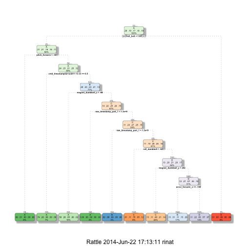

Practical Machine Learning Project By RRK
========================================================

Read the data files into pmlTraining and pmlTesting:

```r
setwd("~/Box Sync/Coursera/PracticalMachineLearning/project")
pmlTraining<-read.csv("pml-training.csv") 
pmlTesting<-read.csv("pml-testing.csv") 
```

Clean the data from columns that have more than 19,000 NA

```r
#training
pmlIsNATraining<-is.na(pmlTraining)
arrSumNATraining<-apply(pmlIsNATraining,2,sum) #for each column, how many are NA
bIsNAColumnTraining<-(arrSumNATraining>19000)
pmlTrainingClean<-pmlTraining[,!bIsNAColumnTraining]
#testing
pmlTestingClean<-pmlTesting[,!bIsNAColumnTraining]
```

Clean the data from columns that have more than 19,000 ""

```r
#training
pmlEmptyTraining<-pmlTrainingClean==""
arrSumEmptyTraining<-apply(pmlEmptyTraining,2,sum)
bIsEmptyColumnTraining<-(arrSumEmptyTraining>19000)
pmlTrainingClean<-pmlTrainingClean[,!bIsEmptyColumnTraining]
#testing
pmlTestingClean<-pmlTestingClean[,!bIsEmptyColumnTraining]
```
After clearning the data, 60 variables remained:

```r
names(pmlTrainingClean)
```

```
##  [1] "X"                    "user_name"            "raw_timestamp_part_1"
##  [4] "raw_timestamp_part_2" "cvtd_timestamp"       "new_window"          
##  [7] "num_window"           "roll_belt"            "pitch_belt"          
## [10] "yaw_belt"             "total_accel_belt"     "gyros_belt_x"        
## [13] "gyros_belt_y"         "gyros_belt_z"         "accel_belt_x"        
## [16] "accel_belt_y"         "accel_belt_z"         "magnet_belt_x"       
## [19] "magnet_belt_y"        "magnet_belt_z"        "roll_arm"            
## [22] "pitch_arm"            "yaw_arm"              "total_accel_arm"     
## [25] "gyros_arm_x"          "gyros_arm_y"          "gyros_arm_z"         
## [28] "accel_arm_x"          "accel_arm_y"          "accel_arm_z"         
## [31] "magnet_arm_x"         "magnet_arm_y"         "magnet_arm_z"        
## [34] "roll_dumbbell"        "pitch_dumbbell"       "yaw_dumbbell"        
## [37] "total_accel_dumbbell" "gyros_dumbbell_x"     "gyros_dumbbell_y"    
## [40] "gyros_dumbbell_z"     "accel_dumbbell_x"     "accel_dumbbell_y"    
## [43] "accel_dumbbell_z"     "magnet_dumbbell_x"    "magnet_dumbbell_y"   
## [46] "magnet_dumbbell_z"    "roll_forearm"         "pitch_forearm"       
## [49] "yaw_forearm"          "total_accel_forearm"  "gyros_forearm_x"     
## [52] "gyros_forearm_y"      "gyros_forearm_z"      "accel_forearm_x"     
## [55] "accel_forearm_y"      "accel_forearm_z"      "magnet_forearm_x"    
## [58] "magnet_forearm_y"     "magnet_forearm_z"     "classe"
```

```r
names(pmlTestingClean)
```

```
##  [1] "X"                    "user_name"            "raw_timestamp_part_1"
##  [4] "raw_timestamp_part_2" "cvtd_timestamp"       "new_window"          
##  [7] "num_window"           "roll_belt"            "pitch_belt"          
## [10] "yaw_belt"             "total_accel_belt"     "gyros_belt_x"        
## [13] "gyros_belt_y"         "gyros_belt_z"         "accel_belt_x"        
## [16] "accel_belt_y"         "accel_belt_z"         "magnet_belt_x"       
## [19] "magnet_belt_y"        "magnet_belt_z"        "roll_arm"            
## [22] "pitch_arm"            "yaw_arm"              "total_accel_arm"     
## [25] "gyros_arm_x"          "gyros_arm_y"          "gyros_arm_z"         
## [28] "accel_arm_x"          "accel_arm_y"          "accel_arm_z"         
## [31] "magnet_arm_x"         "magnet_arm_y"         "magnet_arm_z"        
## [34] "roll_dumbbell"        "pitch_dumbbell"       "yaw_dumbbell"        
## [37] "total_accel_dumbbell" "gyros_dumbbell_x"     "gyros_dumbbell_y"    
## [40] "gyros_dumbbell_z"     "accel_dumbbell_x"     "accel_dumbbell_y"    
## [43] "accel_dumbbell_z"     "magnet_dumbbell_x"    "magnet_dumbbell_y"   
## [46] "magnet_dumbbell_z"    "roll_forearm"         "pitch_forearm"       
## [49] "yaw_forearm"          "total_accel_forearm"  "gyros_forearm_x"     
## [52] "gyros_forearm_y"      "gyros_forearm_z"      "accel_forearm_x"     
## [55] "accel_forearm_y"      "accel_forearm_z"      "magnet_forearm_x"    
## [58] "magnet_forearm_y"     "magnet_forearm_z"     "problem_id"
```

Remove the var X as it perfectly correlate to the outcome

```r
pmlTrainingClean<-pmlTrainingClean[,-1]
pmlTestingClean<-pmlTestingClean[,-1]
```


Split the training data to training and testingCV (testing cross validation)

```r
library(caret)
```

```
## Loading required package: lattice
## Loading required package: ggplot2
```

```r
library(AppliedPredictiveModeling)
library(ggplot2)
inTrain = createDataPartition(pmlTrainingClean$classe, p = 3/4,list=FALSE)
training = pmlTrainingClean[ inTrain,]
testingCV = pmlTrainingClean[-inTrain,]
```

Train the training data with rpart

```r
modelFit<-train(classe ~., data=training, method="rpart")
```

```
## Loading required package: rpart
```

```r
library(rattle)
```

```
## Rattle: A free graphical interface for data mining with R.
## Version 3.0.2 r169 Copyright (c) 2006-2013 Togaware Pty Ltd.
## Type 'rattle()' to shake, rattle, and roll your data.
```

```r
fancyRpartPlot(modelFit$finalModel)
```

```
## Loading required package: rpart.plot
## Loading required package: RColorBrewer
```

 

Make a prediction for the testingCV dataset with rpart

```r
confusionMatrix(testingCV[,59],predict(modelFit, newdata=testingCV))
```

```
## Confusion Matrix and Statistics
## 
##           Reference
## Prediction    A    B    C    D    E
##          A 1072  114  134   74    1
##          B  222  428  159  140    0
##          C   28   87  726   14    0
##          D   47  131  261  365    0
##          E   13  245  183   51  409
## 
## Overall Statistics
##                                         
##                Accuracy : 0.612         
##                  95% CI : (0.598, 0.625)
##     No Information Rate : 0.298         
##     P-Value [Acc > NIR] : <2e-16        
##                                         
##                   Kappa : 0.509         
##  Mcnemar's Test P-Value : <2e-16        
## 
## Statistics by Class:
## 
##                      Class: A Class: B Class: C Class: D Class: E
## Sensitivity             0.776   0.4259    0.496   0.5668   0.9976
## Specificity             0.908   0.8664    0.963   0.8969   0.8905
## Pos Pred Value          0.768   0.4510    0.849   0.4540   0.4539
## Neg Pred Value          0.912   0.8541    0.818   0.9320   0.9998
## Prevalence              0.282   0.2049    0.298   0.1313   0.0836
## Detection Rate          0.219   0.0873    0.148   0.0744   0.0834
## Detection Prevalence    0.284   0.1935    0.174   0.1639   0.1837
## Balanced Accuracy       0.842   0.6461    0.729   0.7319   0.9440
```


Train the training data with rf and make a prediction for testingCV dataset

```r
modelFit<-train(classe ~., data=training, method="rf")
```

```
## Loading required package: randomForest
## randomForest 4.6-7
## Type rfNews() to see new features/changes/bug fixes.
```

```r
confusionMatrix(testingCV[,59],predict(modelFit, newdata=testingCV))
```

```
## Confusion Matrix and Statistics
## 
##           Reference
## Prediction    A    B    C    D    E
##          A 1395    0    0    0    0
##          B    0  949    0    0    0
##          C    0    0  855    0    0
##          D    0    0    2  802    0
##          E    0    0    0    0  901
## 
## Overall Statistics
##                                     
##                Accuracy : 1         
##                  95% CI : (0.999, 1)
##     No Information Rate : 0.284     
##     P-Value [Acc > NIR] : <2e-16    
##                                     
##                   Kappa : 0.999     
##  Mcnemar's Test P-Value : NA        
## 
## Statistics by Class:
## 
##                      Class: A Class: B Class: C Class: D Class: E
## Sensitivity             1.000    1.000    0.998    1.000    1.000
## Specificity             1.000    1.000    1.000    1.000    1.000
## Pos Pred Value          1.000    1.000    1.000    0.998    1.000
## Neg Pred Value          1.000    1.000    1.000    1.000    1.000
## Prevalence              0.284    0.194    0.175    0.164    0.184
## Detection Rate          0.284    0.194    0.174    0.164    0.184
## Detection Prevalence    0.284    0.194    0.174    0.164    0.184
## Balanced Accuracy       1.000    1.000    0.999    1.000    1.000
```

Make prediction for the 20 items test set. 

```r
answers=predict(modelFit,newdata=pmlTestingClean)
```
Write files for submission

```r
pml_write_files = function(x){
  n = length(x)
  for(i in 1:n){
    filename = paste0("problem_id_",i,".txt")
    write.table(x[i],file=filename,quote=FALSE,row.names=FALSE,col.names=FALSE)
  }
}

pml_write_files(answers)
```
